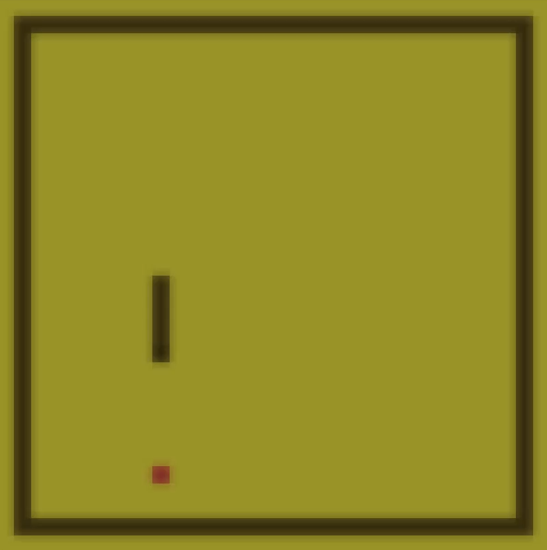

<!-- markdownlint-disable MD033 -->

# Snake



A simple [snake game](https://en.wikipedia.org/wiki/Snake_(video_game_genre))
made in the [C programming language](https://en.wikipedia.org/wiki/C_(programming_language))
using the [TIGR graphics library](https://github.com/erkkah/tigr). \
Player's mission is to collect all the red dots in the screen and avoid colliding with itself or borders.

## Installation

### Windows

#### MSYS2

Install MSYS2 from here: <https://www.msys2.org/>\
Install git:

```console
pacman -S git
```

Exit from the MSYS2 console, open a terminal, copy paste and run this command:

```console
git clone https://github.com/Ibrahimbag/snake.git &&
cd snake &&
make
```

#### WSL

Another way to do other than MSYS2 is WSL.\
Install WSL from here: <https://learn.microsoft.com/en-us/windows/wsl/install>

After successfully installing WSL, copy paste and run this command:

```bash
sudo apt install build-essential git && # This might differ depending on your distro
git clone https://github.com/Ibrahimbag/snake.git &&
cd snake &&
make
```

### Linux

Open a terminal and copy paste and run this command:

```bash
sudo apt install build-essential git && # This might differ depending on your distro 
git clone https://github.com/Ibrahimbag/snake.git &&
cd snake &&
make
```

## Usage

If the compilation is successful, there should be a new binary file called "snake".\
Run it like this below:

```console
./snake
```

Use <kbd>arrow</kbd> keys for moving, <kbd>ESC</kbd> button to close the game.

## Sounds

score.mp3 by [chieuk](https://pixabay.com/users/chieuk-46505609/) <https://pixabay.com/sound-effects/coin-257878/>

crash.mp3: <https://sfxengine.com/sound-effects/collisions>
